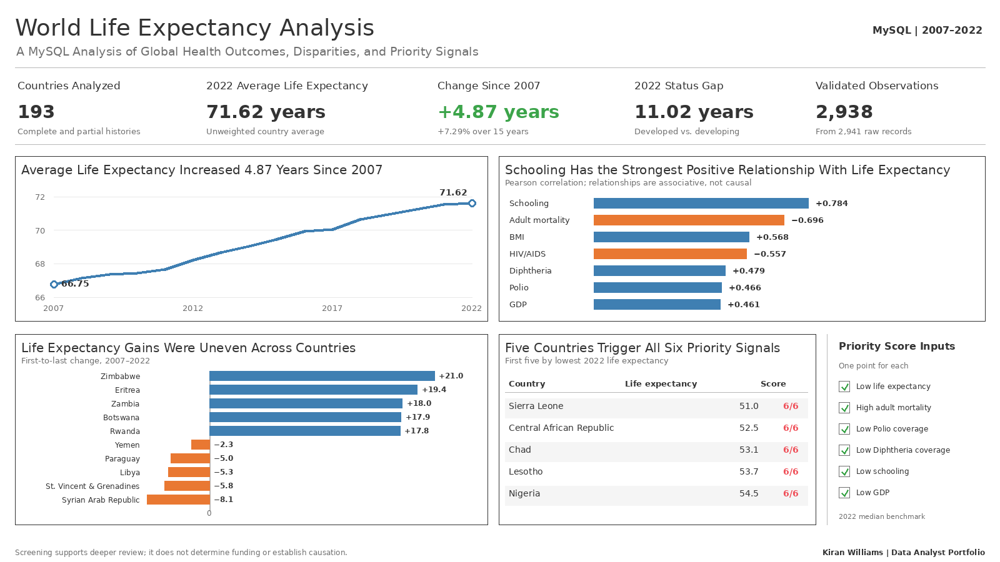

# Kiran Williams

**Business Analyst | Data Analyst | BI Analyst**

I use data to clarify business problems, measure performance, and help people make better operational decisions. My background includes more than eight years across retail operations, event operations, workforce management, and education, giving me experience working with both the data behind a process and the people affected by it.

My projects show how I approach analytical work from beginning to end: define the decision, validate the data, select useful measures, communicate limitations, and turn the results into practical recommendations.

[View Résumé (PDF)](resume/Kiran_Williams_Resume.pdf)

## Technical Skills

- **Analysis:** SQL, Excel, Google Sheets, Cognos Analytics, exploratory analysis, and data cleaning
- **Visualization:** Tableau, PivotTables, PivotCharts, slicers, dashboard development, and KPI reporting
- **Business analysis:** requirements definition, stakeholder communication, data governance, operational reporting, and process improvement
- **Currently developing:** Power BI, Python, and R

## Featured Projects

### [Student Performance Analytics](https://github.com/keyswill/student-performance-analysis)

**Tableau | Education Analytics | Decision Support**

School leaders often review grades, attendance, behavior, and interventions separately. I connected those records in a three-dashboard decision-support tool for 120 simulated middle-school students. The analysis found a moderate relationship between attendance and grades and included safeguards against overstating subgroup and intervention results.

**Decision supported:** Which students, groups, and time periods should school leaders review more closely?

### [Maryland 2026 Primary Turnout Analysis](https://github.com/keyswill/maryland-2026-primary-turnout-analysis)

**Tableau | Civic Analytics | Geographic Performance**

Statewide turnout can hide local participation differences, while raw vote totals can overemphasize larger jurisdictions. I analyzed all 24 Maryland counties and county-equivalents, comparing eligible voters, cards cast, turnout rates, non-voters, county rankings, and geographic patterns. The analysis found 16.68% statewide turnout, with county rates ranging from 12.43% to 24.11%.

**Decision supported:** Which counties should election administrators, civic organizations, and outreach teams investigate first when balancing participation gaps with the size of the eligible-voter population?

### [World Life Expectancy Analysis](https://github.com/keyswill/world-life-expectancy-analysis)

**MySQL | Data Quality | Resource Prioritization**

I built an auditable MySQL workflow that converted 2,941 raw country-year records into 2,938 validated observations covering 193 countries. The analysis combines trends, peer comparisons, correlations, and a transparent priority score to identify countries that may warrant deeper program review.

**Decision supported:** Where should a global health organization focus additional investigation before committing limited resources?

### [Electronics Sales Performance Analysis](https://github.com/keyswill/e-commerce-business-performance-analysis)

**Excel | Sales Analytics | Interactive Dashboard**

I cleaned 30,394 raw rows into 30,206 validated transaction lines and built an Excel dashboard covering **$5.64 million in revenue**, **29,018 unique orders**, and **33,969 units sold**. The analysis showed that laptops and phones produced 61% of revenue, while batteries led unit sales but contributed less than 1% of revenue.

**Decision supported:** Which products drive revenue, which drive volume, and where is sales performance concentrated?

### [Employee Satisfaction Analysis](https://github.com/keyswill/employee-satisfaction-analysis)

**Tableau | Workforce Analytics | Simulated Course Data**

I joined 1,000 employee profiles to 3,711 survey responses and built a Tableau dashboard comparing workplace satisfaction across departments, compensation levels, locations, and time. Department concerns were normalized to support fair comparisons, and the analysis distinguishes association from causation.

**Decision supported:** Which workforce concerns should leaders investigate, and where might targeted employee-support efforts be most useful?

### [Mansfield Residential Listing Analysis](https://github.com/keyswill/mansfield-residential-listing-analysis)

**Tableau | Real Estate Analytics | Market Benchmarking**

I analyzed 336 archived Mansfield, Texas listings using outlier-aware KPIs, interactive filters, and geographic visualization. Property size had the strongest available relationship with listing price, while unequal listing-type samples limited broader comparisons.

**Decision supported:** How should users compare listing prices without allowing a small number of luxury properties to distort the market picture?

## Project in Progress

### [Citi Bike Operational Analytics](https://github.com/keyswill/citibike-operational-analytics)

**MySQL | ETL | Data Validation | Operational Analytics | Tableau**

I am analyzing **4,674,903 Citi Bike trips from May 2026** to determine when demand is highest, which stations handle the most activity, and where pickup and return patterns may indicate operational pressure.

Data ingestion, staging, validation, business understanding, and data understanding are complete. The remaining phases will cover cleaning, exploratory analysis, recommendations, and an executive Tableau dashboard.

**Decision supported:** Which stations and time periods should Citi Bike operations teams monitor or investigate first?

## Education and Certifications

- MBA, University of Maryland Global Campus — Expected May 2028, GPA: 4.0/4.0
- M.S. in Data Analytics, University of Maryland Global Campus — Expected May 2027, GPA: 4.0/4.0
- Graduate Certificate in Business Analytics, University of Maryland Global Campus — August 2026
- Google Data Analytics Certificate — September 2021
- B.A. in Chemistry, University of Maryland Baltimore County — December 2020

## Connect

[LinkedIn](https://www.linkedin.com/in/kiranwilliams/) |
[Email](mailto:kiranwilliams1997@gmail.com)
