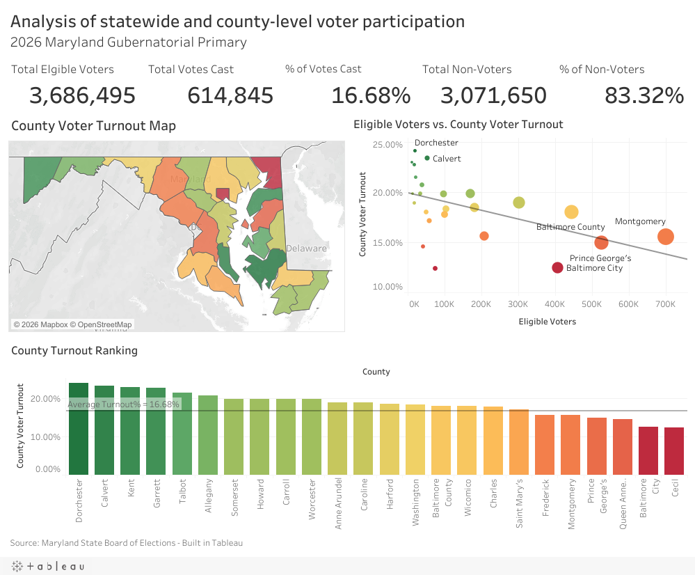

# Maryland 2026 Primary Turnout Analysis

An interactive Tableau case study examining statewide and county-level participation in Maryland's 2026 gubernatorial primary election.

## Executive Summary

Statewide turnout can hide large differences among counties, while raw vote totals can make high-population jurisdictions appear more engaged simply because they contain more eligible voters. This project combines participation counts, turnout rates, a county map, a population-versus-turnout comparison, and county rankings in one dashboard.

Across Maryland's 23 counties and Baltimore City, the source data reports **3,686,495 eligible voters**, **614,845 cards cast**, and a **16.68% statewide turnout rate**. County turnout ranged from **12.43% in Cecil County** to **24.11% in Dorchester County**.

The dashboard is designed to help election administrators, civic organizations, campaigns, and researchers identify geographic participation gaps and decide where further investigation or outreach may be warranted. It does not explain why turnout differed.

## Decision Problem

Organizations working on election administration or voter engagement need to answer three questions:

1. Which counties participated above or below the statewide benchmark?
2. Where are the largest numbers of eligible voters and non-voters concentrated?
3. Does a larger eligible-voter population correspond to a higher or lower turnout rate?

Comparing both rates and counts matters. A small county may have a high turnout rate but affect relatively few voters, while a large county with a modestly below-average rate may represent a much larger outreach opportunity.

See the complete [Business Understanding](docs/business_understanding.md) and [Data Understanding](docs/data_understanding.md).

## Stakeholders and Decisions

| Stakeholder | Decision supported |
| --- | --- |
| State and local election administrators | Which counties warrant closer review of participation and access patterns |
| Civic and voter-engagement organizations | Where county-level outreach or education may have the greatest opportunity |
| Campaign and public-affairs teams | How to compare participation rates with the size of the eligible-voter population |
| Journalists and researchers | Which geographic patterns merit additional reporting or analysis |

## Dashboard

[Open the interactive dashboard on Tableau Public](https://public.tableau.com/views/Analysisofstatewideandcounty-levelparticipationduringMD2026gubernatorialprimary/EligibleVotersvs_VoterTurnoutbyCounty?:language=en-US&:sid=&:redirect=auth&:display_count=n&:origin=viz_share_link)

The dashboard contains:

- Statewide KPIs for eligible voters, cards cast, turnout, non-voters, and non-voter percentage
- A county turnout map
- A scatterplot comparing eligible voters with turnout rate
- A county ranking against the 16.68% statewide benchmark

## Validated Findings

1. **Statewide turnout was 16.68%.** Of 3,686,495 eligible voters in the source data, 614,845 cast a ballot and 3,071,650 did not.
2. **County turnout varied by 11.68 percentage points.** Dorchester ranked first at 24.11%; Cecil ranked last at 12.43%.
3. **The five highest turnout rates were in Dorchester, Calvert, Kent, Garrett, and Talbot.** All five exceeded 21%.
4. **The five lowest turnout rates were in Cecil, Baltimore City, Queen Anne's, Prince George's, and Montgomery.** Each was below the statewide rate.
5. **Larger eligible-voter populations were moderately associated with lower turnout rates.** Across the 24 jurisdictions, the Pearson correlation was approximately **-0.51**. This is a descriptive county-level relationship, not evidence that population size causes lower turnout.

## Recommendations

- Use turnout rate to flag underperforming counties, then use eligible-voter and non-voter counts to assess the potential scale of outreach.
- Prioritize deeper review of large jurisdictions below the statewide benchmark, including Montgomery, Prince George's, and Baltimore City.
- Compare high-turnout counties with similar peer counties before transferring outreach or election-administration practices.
- Add precinct, voting-method, historical, demographic, and access data before recommending a specific intervention.
- Recalculate the statewide benchmark dynamically if the dataset is expanded or filtered.

## Tools and Skills Demonstrated

- Tableau dashboard design and data visualization
- Calculated fields, geographic mapping, rankings, reference lines, and trend analysis
- KPI definition and weighted statewide aggregation
- Stakeholder-focused analysis and decision framing
- Data validation, analytical guardrails, and limitations reporting

## Repository Guide

| Path | Contents |
| --- | --- |
| [`dashboard/`](dashboard/) | Dashboard image and packaged Tableau workbook |
| [`data/county_turnout.csv`](data/county_turnout.csv) | County-level values exported from the published workbook |
| [`docs/business_understanding.md`](docs/business_understanding.md) | Decision problem, stakeholders, success measures, and claim boundaries |
| [`docs/data_understanding.md`](docs/data_understanding.md) | Dataset grain, field roles, calculations, quality checks, and limitations |

## Limitations

- The dataset contains one aggregated record per county or county-equivalent and cannot show precinct-level variation.
- It does not include party, voting method, demographic, campaign, access, or historical comparison data.
- The analysis is descriptive and cannot identify the causes of turnout differences.
- The scatterplot contains only 24 geographic observations, so the trend should be treated as a screening signal.
- “Eligible voters” is retained from the source terminology; the dashboard does not independently reconstruct voter eligibility.

## Data Source

[Maryland State Board of Elections — Official 2026 Gubernatorial Primary Election Results](https://elections.maryland.gov/elections/2026/primary_results/index.html)

## Author

Kiran Williams

[LinkedIn](https://www.linkedin.com/in/kiranwilliams/) | [Data Analytics Portfolio](https://github.com/keyswill/data-analytics-portfolio)
